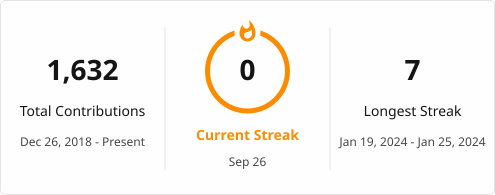

# Hi, I'm Lyco Tatierra 👋

### Developer & IT Professional based in Alabang, Muntinlupa City 🇵🇭

 

## 🚀 About Me

- 👨‍💻 All of my projects are available at **[github.com/Lycol50](https://github.com/Lycol50?tab=repositories)**
- 📫 Reach me at **lyco@thedawnph.net**
- ⚡ Fun fact: **I do sleep**

 

## 🏆 Trophies

 

## 🛠️ Languages & Tools

&nbsp;
&nbsp;
&nbsp;
&nbsp;
&nbsp;
&nbsp;
&nbsp;
&nbsp;
&nbsp;
&nbsp;
&nbsp;
&nbsp;

 

## 🌐 Connect with Me

 

## 📊 GitHub Stats

 

